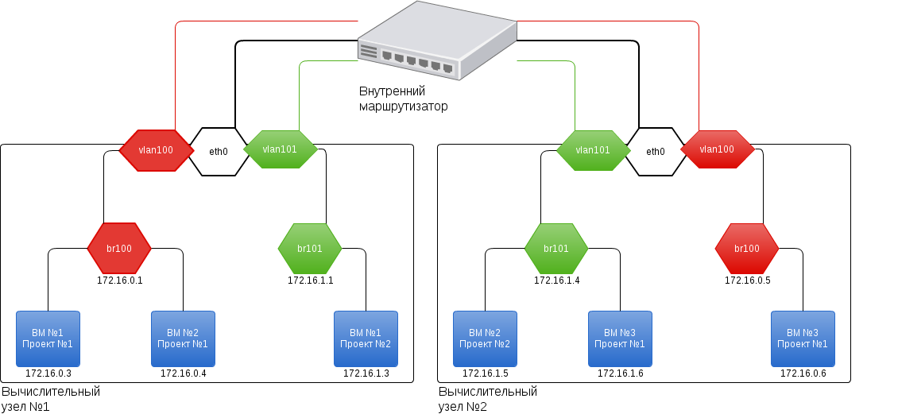

.. openstack documentation master file, created by
   sphinx-quickstart on Mon Mar  4 09:04:25 2013.
   You can adapt this file completely to your liking, but it should at least
   contain the root `toctree` directive.

Руководство по установке и настройке OpenStack 'Folsom'
========================================================

.. toctree::
   :maxdepth: 2

Компоненты Openstack
=====================

`OpenStack <http://www.openstack.org/>`_ — это комплекс проектов свободного (`Apache License, Version 2.0 <http://www.apache.org/licenses/LICENSE-2.0>`_) программного обеспечения, предназначенного для создания вычислительных облаков и облачных хранилищ.

На данный момент OpenStack содержит семь ключевых компонентов:

	* Сервис авторизации и аутентификации «Keystone» 
	* Хранилище образов «Glance»
	* Вычислительный сервис «Nova»
	* Сетевой сервис Quantum
	* Сервис хранения блоков данных «Cinder» 
	* Хранилище объектов «Swift»
	* Веб-интерфейс «Horizon» 

Установка сервисов OpenStack будет производиться из пакетов, на основе операционной системы Ubuntu 12.04 «Precise», c использованием системы автоматизации процесса установки и настройки программного обеспечения Chef.

В данном руководстве рассмаривается структура облака, когда все облачные сервисы, кроме вычислительного, расположены на одном узле, называемом "контроллером облака", к которому по локальной сети подключаются вычислительные узлы. 

Вычислительный сервис nova-compute использует гипервизор `KVM <http://www.linux-kvm.org/page/Main_Page>`_

Для обеспечения живой миграции виртуальных машин используется сетевая файловая система NFS версии 3.

Публичным и приватным адресам вируальных машин с использованием `MyDns <http://mydns.bboy.net/>`_ автоматически выдаются доменные имена. 

Хранилища образов, дисков виртуальных машин и объектов располагаются на LVM томах.

Quantum
--------

.. figure:: quantum.png

За работу с сетевой частью OpenStack отвечает библиотека Quantum, которая обеспечивает функцию «сеть как сервис» между сетевыми интерфейсами ВМ (vNIC) под управлением других сервисов OpenStack, фактически предоставляя API, позволяющее управлять всей сетевой частью облака. В зависимости от поставленных задач и спроектированной целевой конфигурации облака, к Quantum можно подключать плагины, такие как Open vSwith, Cisco UCS/Nexus, Linux Brige, NEC OpenFlow, Nicira Network Virtualization Platform (NVP) и некоторые другие. 

Наиболее продвинутый вариант реализации сетевой инфраструктуры, в котором каждый(!) тенант получает приватный роутер, с возможностью создания дополнительных роутеров для каждого тенанта через Quantum API. Тенант может создавать свои сети, с возможностью подключения к роутеру. Теперь самое главное: данная схема позволяет каждому тенанту использовать любые сети, т.к. доступ вовне обеспечивается или через SNAT или Floating IPs. Иными словами, в облаке может быть несколько ВМ с одинаковыми(!) внутренними IP-адресами. Это может пригодиться, например, при переходе с одного облака на другое – запаковал машины, слил образ, настроил требуемую инфраструктуру на другом облаке, назначил IP-адреса, которые у тебя были ранее, развернул образы и все полетело без дополнительных изменений. Тот, кто часто вынужден был переносить сервера из одной подсети в другую, наверняка оценят эту возможность. С другой стороны, как часто вам может потребоваться таскать свою инфраструктуру между разными облаками?

Подготовка сетевых интерфейсов: ::
	
	# VM internet Access
	auto eth2
	iface eth2 inet manual
	up ifconfig $IFACE 0.0.0.0 up
	up ip link set $IFACE promisc on
	down ip link set $IFACE promisc off
	down ifconfig $IFACE down

	# OpenStack management
	auto eth0
	iface eth0 inet static
	address 100.10.10.52
	netmask 255.255.255.0

	# VM Configuration
	auto eth1
	iface eth1 inet static
	address 100.20.20.52
	netmask 255.255.255.0 

	# Public interface
	auto eth0
	iface eth0 inet manual
	up ifconfig $IFACE 0.0.0.0 up
	up ip link set $IFACE promisc on
	down ip link set $IFACE promisc off
	down ifconfig $IFACE down

	# Private interface
	auto br-int
	iface br-int inet static
		bridge_ports eth1
		address 10.10.10.1
		netmask 255.0.0.0

В настоящем руководстве для установки компонентов облачной инфраструктуры OpenStack, мы будем использовать продукт `OpstChef <http://www.opst.com/chef>`_. Это Open-Source инструмент управления инфраструктурой серверов. Мы будем рассматривать упрощенный вариант использования этого инструмента, без настройки Chef-сервера, а ограничимся использованием knife-solo. 

Первым делом на управляющей машине необходимо установить менеджер пакетов для языка программирования Руби - RubyGems. В операционной системе Ubuntu сделать это можно c помощью стандартного пакетного менеджера командой:

``sudo apt-get install -y rubygems``

``sudo gem-install knife-solo``

``knife configure -r .defaults``

.. figure:: first.png
   :align: center
   :figclass: text

Используемые скрипты для chef расчитаны на использование на будующих узлах облачной инфраструктуры опреационной системы Ubuntu версии 12.04, и налагает следующие требования: :: 

	set[:mysql][:password]="mySuperSecret"

	set[:controller][:private_ip]="10.10.10.1"
	set[:controller][:public_ip]="192.168.0.101"

	set[:keystone][:token]="mySuperSecret"
	set[:keystone][:password]="mySuperSecret"
	set[:keystone][:email]="admin@post.domain.ru"

	set[:dns][:zone]="cloud.domain.ru"

Работа с облачной системой OpenStack, помимо Web-интерфейса, может осуществляться с помощью `nova-client <http://pypi.python.org/pypi/python-novaclient>`_ или инструмента `euca2ools <http://open.eucalyptus.com/wiki/Euca2oolsGuide>`_. В данном руководстве мы постараемся приводить команды для обоих этих инструментов. 

Для использования команд nova, на клиентской машине необходимо установить пакет python-novaclient:  

``sudo apt-get install python-novaclient``

и аутентифицироваться с помощью openrc файла для нужного проекта, который можно загрузить через Web-интерфейс, на вкладке settings 

.. note::

	 Добавьте в файл openrc строчку **export OS\_NO\_CACHE=1** это избавит Вас от необходимости каждый раз вводить пароль связки ключей, при использовании последней версии клиента

После загрузки файла выполните команду:

``source openrc.sh``

Для использования команд euca, на клиентской машине необходимо установить пакет euca2ools:

``sudo apt-get install euca2ools``

и аутентифицироваться с помощью сертификатов EC2. Скачайте zip-архив на странице настроек проекта, распакуйте файлы и выполните

``source ec2rc.sh``

Для запуска виртуальных в облачной инфраструктуре OpenStack используются образы дисков операционных систем. В последней версии Glance добавлена также возможность создания виртуальной машины и установки операционной системы из iso-образа. Мы рассмотрим два основных формата образов дисков:

    * AMI (англ. Amazon Machine Image). Образ операционной системы в этом формате состоит из трех частей: AKI (англ. Amazon Kernel Image) , ARI (англ. Amazon Ramdisk Image) AMI
    * QCOW2 - это формат дискового образа программы QEMU. Название является аббревиатурой названия формата Copy-On-Write (копирование при записи).
  
Первым шагом будет создание пустого файла образа диска. Современная операционная система семейства Windows требует для работы большое количество дискового пространства, не менее чем 20 GB.

``kvm-img create -f raw windowsserver.img 20G``

Openstack использует интерфейс Virtio для дисков и сетевых адаптеров при запуске виртуальных машин. Это означает, что операционная система виртуальной машины должна иметь драйверы для Virtio. По умолчанию операционные машины семейства Windows не содержат таких драйверов, их необходимо предоставить операционной системе в процессе установки. Образ дискеты с последней версией необходимых драйверов доступен для скачивания c сайта `проекта fedora <http://alt.fedoraproject.org/pub/alt/virtio-win/latest/images/bin/>`_
Процесс установки Windows можно запустить с помощью команды.

``kvm -m 1024 -cdrom windows.iso -drive file=windowsserver.img, if=virtio,boot=on -fda virtio-win-1.1.16.vfd -boot d -nographic -vnc :0``

Здесь параметром cdrom указывается путь к образу установочного диска операционной системы, например windows.iso. Параметр drive - предварительно созданный образ жесткого диска. Параметром fda задается путь к загруженному образу дискеты с драйверами windows.  
После запуска команды начнется стандартный процесс установки Windows. К Консоли управления можно подключиться с помощью любого обозревателя VNC, например vncviewer:

``sudo apt-get install vncviewer -y``

на порт 5900. 

``vncviewer localhost:5900`` 

Если создание образа производится на удаленной машине, подключиться к VNC-консоли можно с использованием ssh-туннеля, например так:

``vncviewer -via "laboshinl@192.168.0.100 -p 22" localhost:0``

Необходимо следовать инструкциям, появляющимся на экране. В процессе установки в окне выбора жесткий диск, не будет выведено каких-либо устройств. Необходимо нажать на кнопку "Загрузить драйверы", в левом нижнем углу и указать путь к подключенным драйверам после чего продолжить установку 

.. note::
	
	 Для удобства дальнейшего использования образа рекомендуется после завершения установки разрешить удаленное администрирование системы через RDP(RemoteDesktopProtocol)

`Тестовые образы от Cirros <https://launchpad.net/cirros/trunk/0.3.0/>`_

`Официальные образы релизов Ubuntu <http://uec-images.ubuntu.com/>`_

Готовые образы некоторых операционных систем доступны так же на сайте `нашего проекта <http://xenlet.stu.neva.ru>`_

``nova cloudpipe-create $project_ID``

Шаблон конфирурационного файла для openvpn ::

	# Edit the following lines to point to your cert files:
	cert cert.pem
	key pk.pem

	ca cacert.pem

	client
	dev tap
	proto udp

	remote $controller_public_ip $port
	resolv-retry infinite
	nobind

	# Downgrade privileges after initialization (non-Windows only)
	user nobody
	group nogroup
	comp-lzo

	# Set log file verbosity.
	verb 2

	keepalive 10 120
	ping-timer-rem
	persist-tun
	persist-key

CEPH
------

`Ceph <http://ceph.com>`_ — свободная распределённая файловая система. Ceph может использоваться на системах, состоящих как из нескольких машин, так и из тысяч узлов. Общий объем хранилища данных может измеряться петабайтами, встроенные механизмы продублированной репликации данных (не зависит от отказа отдельных узлов) обеспечивают чрезвычайно высокую живучесть системы, при добавлении или удалении новых узлов, массив данных автоматически перебалансируется с учетом новшеств.

Установка

``gpg --keyserver keyserver.ubuntu.com --recv 17ED316D``

``gpg --export --armor 17ED316D | apt-key add -``
